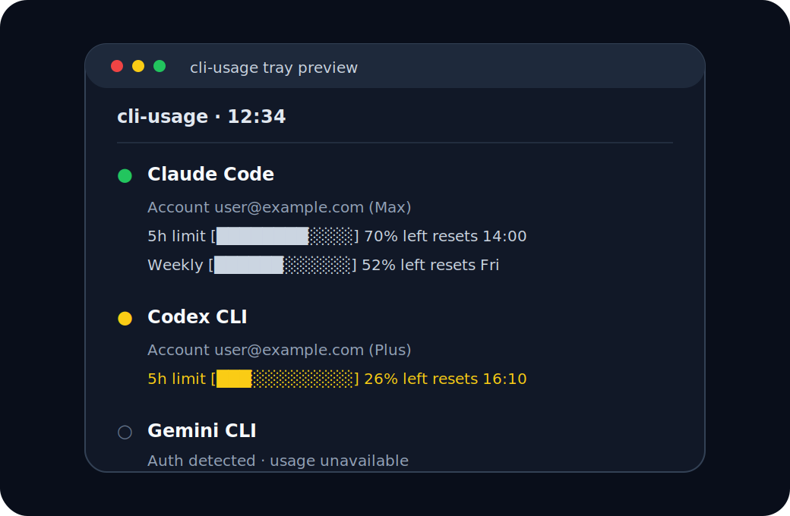

<p align="center">
  
</p>

<h1 align="center">cli-usage</h1>

<p align="center">
  Never get surprised by AI CLI rate limits again.
</p>

<p align="center">
  
  
  
  
</p>

<p align="center">
  <strong>A tiny tray/menu-bar indicator for Claude Code, Codex CLI, and Gemini CLI usage.</strong>
</p>

> **Note:** This project was vibe coded — built quickly with AI-assisted flow, practical first, polished enough to ship.

## Preview

<p align="center">
  
</p>

## What it tracks

`cli-usage` keeps a small always-visible `CLI` indicator in your tray/menu bar and shows:

- installed AI CLI tools
- account/auth status
- remaining usage/rate-limit windows
- reset times
- one-click terminal shortcuts for each installed CLI
- low-usage warnings when limits are getting close

## Supported CLIs

| CLI | Status | What shows |
| --- | --- | --- |
| **Claude Code** | Supported | Account, tier, 5h limit, weekly limits, model-specific weekly limits when available |
| **Codex CLI** | Supported | Account, plan, 5h limit, weekly limit, additional limits, credits when available |
| **Gemini CLI** | Partial | Credential/auth detection. Live usage is not shown because there is no stable public usage endpoint wired in. |

## Cool bits

- Cross-platform tray frontend for **macOS**, **Windows**, and **Linux** using `pystray`
- Native GTK/AppIndicator frontend for Linux desktops that support AppIndicator
- Auto-refreshes every 60 seconds
- Color-coded warning icon in the cross-platform frontend:
  - green = healthy
  - yellow = under 30% left
  - red = under 10% left
- GTK frontend switches to warning/error-style system icons when usage gets low
- Login/startup installer scripts for Linux, macOS, and Windows
- No token logging and no extra analytics

## Install in 30 seconds

Clone the repository:

```bash
git clone https://github.com/nimaansari/CLI-Usage.git
cd CLI-Usage
```

### Linux

For GNOME/AppIndicator integration:

```bash
chmod +x setup.sh
./setup.sh
```

Or run manually:

```bash
python3 cli_usage_gtk.py
```

For the cross-platform pystray frontend:

```bash
python3 -m pip install --user pystray Pillow
python3 cli_usage_xplat.py
```

### macOS

```bash
chmod +x setup_macos.sh
./setup_macos.sh
```

Manual run:

```bash
python3 -m pip install --user pystray Pillow
python3 cli_usage_xplat.py
```

### Windows

From PowerShell:

```powershell
powershell -ExecutionPolicy Bypass -File .\setup_windows.ps1
```

Manual run:

```powershell
python -m pip install --user pystray Pillow
python .\cli_usage_xplat.py
```

## Requirements

### Common

- Python 3.9+
- The CLI tools you want to monitor installed and authenticated:
  - `claude`
  - `codex`
  - `gemini`

### macOS / Windows / generic Linux frontend

```bash
python3 -m pip install --user pystray Pillow
```

### Linux GTK/AppIndicator frontend

Debian/Ubuntu-style systems:

```bash
sudo apt-get install -y \
  gir1.2-ayatanaappindicator3-0.1 \
  gnome-shell-extension-appindicator \
  python3-gi \
  python3-gi-cairo
```

## How it works

`cli_usage_core.py` contains the shared data layer. It checks whether each CLI executable exists, reads local auth/account metadata, and calls first-party usage endpoints when available:

- Claude Code: Anthropic OAuth usage endpoint
- Codex CLI: ChatGPT Codex usage endpoint
- Gemini CLI: local credential detection only

Frontends:

- `cli_usage_gtk.py` — Linux GTK/AppIndicator tray frontend
- `cli_usage_xplat.py` — pystray frontend for macOS, Windows, and Linux

## Privacy

This app reads local CLI credential files only to discover the current account and request usage data from the relevant first-party service. It does **not** store tokens, print tokens, or send them anywhere other than the official usage endpoints used by the corresponding CLI provider.

Still, treat this like any local tool that can read CLI auth files: review the code before running it on a machine with sensitive credentials.

## Uninstall

### Linux

```bash
rm -f ~/.config/autostart/cli-usage.desktop
pkill -f cli_usage_gtk.py || true
```

### macOS

```bash
launchctl unload ~/Library/LaunchAgents/com.user.cli-usage.plist
rm -f ~/Library/LaunchAgents/com.user.cli-usage.plist
pkill -f cli_usage_xplat.py || true
```

### Windows

```powershell
Remove-Item "$env:APPDATA\Microsoft\Windows\Start Menu\Programs\Startup\cli-usage.lnk"
```

Then quit the tray app from the menu or stop the Python process.

## Troubleshooting

### The tray icon does not appear on Linux

- Make sure AppIndicator support is installed and enabled.
- On GNOME/Wayland, log out and back in after installing the extension.
- Check logs:

```bash
tail -f /tmp/cli-usage.log
```

### Usage says unavailable

Common causes:

- The CLI is not authenticated.
- The provider changed an internal usage endpoint.
- Network access is blocked.
- The auth file format changed in a new CLI release.

### Gemini usage is unavailable

This is expected. The app currently detects Gemini auth status, but does not show live Gemini usage because there is no stable public endpoint wired into this project.

## Roadmap

- [x] README badges and visual polish
- [x] Mock preview image
- [x] Simple logo/hero art
- [x] Low-usage warning colors/icons
- [ ] Native desktop notifications when usage is low
- [ ] Configurable refresh interval
- [ ] Package as a macOS app / Windows executable
- [ ] Optional config file for hiding unused CLIs
- [ ] Real screenshots from each OS

## Project structure

```text
assets/logo.svg        # README hero logo
assets/screenshot.svg  # README preview mockup
cli_usage_core.py      # shared usage/auth detection
cli_usage_gtk.py       # Linux AppIndicator UI
cli_usage_xplat.py     # pystray cross-platform UI
setup*.sh/ps1          # platform startup installers
```

## License

MIT License. See [LICENSE](LICENSE).
