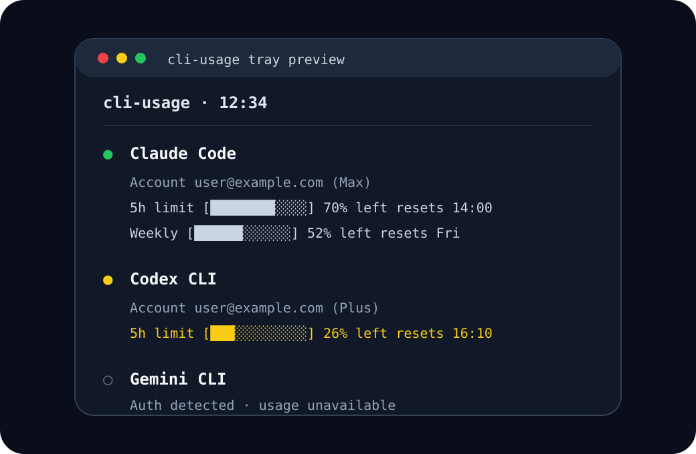

<p align="center">
  
</p>

<h1 align="center">cli-usage</h1>

<p align="center">
  Never get surprised by AI CLI rate limits again.
</p>

<p align="center">
  
  
  
  
</p>

<p align="center">
  <strong>A tiny tray/menu-bar indicator for Claude Code, Codex CLI, and Gemini CLI usage.</strong>
</p>

> **Note:** This project was vibe coded — built quickly with AI-assisted flow, practical first, polished enough to ship.

## Preview

<p align="center">
  
</p>

## What it tracks

`cli-usage` keeps a small always-visible `CLI` indicator in your tray/menu bar and shows:

- installed AI CLI tools
- account/auth status
- remaining usage/rate-limit windows
- reset times
- one-click terminal shortcuts for each installed CLI
- colored status icons in the menu text when limits are getting close

## Supported CLIs

| CLI | Status | What shows |
| --- | --- | --- |
| **Claude Code** | Supported | Account, tier, 5h limit, weekly limits, model-specific weekly limits when available. On macOS the login is read from the Keychain. |
| **Codex CLI** | Supported | Account, plan, rate-limit windows labelled by their real length (5h or weekly, depending on plan), additional limits, credits when available |
| **Gemini CLI** | Partial | Credential/auth detection. Live usage is not shown because there is no stable public usage endpoint wired in. |

## Cool bits

- Cross-platform tray frontend for **macOS**, **Windows**, and **Linux** using `pystray`
- Native GTK/AppIndicator frontend for Linux desktops that support AppIndicator
- Auto-refreshes every 60 seconds
- Color-coded status cues in the app:
  - 🟢 green = healthy
  - 🟡 yellow = under 30% left
  - 🔴 red = under 10% left
- Cross-platform tray icon changes color when usage gets low (on macOS it is a monochrome template icon that follows light/dark mode, with a usage bar under "CLI")
- macOS installer builds a real menu-bar app (`~/Applications/CLI Usage.app`) that starts at login and restarts itself if it quits
- Menu rows include colored status icons beside each limit
- Linux GTK menus use real colored text via Pango markup
- GTK frontend switches to warning/error-style system icons when usage gets low
- Unified `install.py` plus small OS wrapper scripts for Linux, macOS, and Windows
- No token logging and no extra analytics
- Pinned dependency files: `requirements.txt` and `pyproject.toml`
- Provider response shape validation before rendering usage
- Retry/backoff around transient network failures and 429/5xx responses
- Unit tests for formatting, validation, retry behavior, and installer helpers

## Install in 30 seconds

Clone the repository:

```bash
git clone https://github.com/nimaansari/CLI-Usage.git
cd CLI-Usage
```

### Recommended: unified installer

The easiest path is the new cross-platform installer:

```bash
python3 install.py
```

It will:

- check Python version
- choose the best frontend for your OS
- create a local `.venv` and install pinned Python dependencies when needed
- create a per-user startup/login entry
- launch the tray app

Useful installer flags:

```bash
python3 install.py --frontend xplat      # force pystray frontend
python3 install.py --frontend gtk        # force Linux GTK/AppIndicator frontend
python3 install.py --no-autostart        # install/run without login startup
python3 install.py --no-launch           # install only, do not launch now
python3 install.py --skip-deps           # do not install Python packages
python3 install.py --venv .venv-cli-usage # choose a custom virtualenv path
python3 install.py --dry-run             # preview actions without changing files
```

### Linux

```bash
chmod +x setup.sh
./setup.sh
```

`setup.sh` now delegates to `install.py --frontend auto --install-system-deps`. The cross-platform frontend uses a local `.venv`, avoiding messy system/user Python installs.
If you do not want `sudo apt-get` system package installation, use:

```bash
python3 install.py --frontend xplat
```

Manual run:

```bash
python3 cli_usage_gtk.py      # Linux GTK frontend
python3 cli_usage_xplat.py    # cross-platform frontend
```

### macOS

Requires Xcode Command Line Tools (`xcode-select --install`), which provide `python3`, `clang` and `codesign`.

```bash
chmod +x setup_macos.sh
./setup_macos.sh
```

What it sets up:

- `~/Applications/CLI Usage.app`: a small menu-bar-only app (no Dock icon) with its own identity. A bare Python script shows up as "Python", and macOS may hide that from the menu bar.
- A LaunchAgent (`~/Library/LaunchAgents/com.user.cli-usage.plist`) that starts it at login and restarts it if it quits (`KeepAlive`). Its `PATH` includes the folders where `claude`, `codex` and `gemini` were found at install time.
- Claude Code credentials are read from the macOS Keychain (`Claude Code-credentials`). The first time, macOS may ask to allow `security` access. Click **Always Allow**.

Re-run `./setup_macos.sh` after `git pull` to rebuild the app and restart it. If the icon is missing, check **System Settings → Menu Bar → Allow in the Menu Bar** for CLI Usage.

Manual run:

```bash
python3 -m pip install --user -r requirements.txt
python3 cli_usage_xplat.py
```

### Windows

From PowerShell:

```powershell
powershell -ExecutionPolicy Bypass -File .\setup_windows.ps1
```

Manual run:

```powershell
python -m pip install --user -r requirements.txt
python .\cli_usage_xplat.py
```

## Requirements

### Common

- Python 3.9+
- The CLI tools you want to monitor installed and authenticated:
  - `claude`
  - `codex`
  - `gemini`

### macOS / Windows / generic Linux frontend

The installer creates a local virtual environment automatically:

```bash
python3 install.py --frontend xplat
```

Manual install if you prefer managing your own environment:

```bash
python3 -m venv .venv
.venv/bin/python -m pip install -r requirements.txt
.venv/bin/python cli_usage_xplat.py
```

### Linux GTK/AppIndicator frontend

Debian/Ubuntu-style systems:

```bash
sudo apt-get install -y \
  gir1.2-ayatanaappindicator3-0.1 \
  gnome-shell-extension-appindicator \
  python3-gi \
  python3-gi-cairo
```

## How it works

`cli_usage_core.py` contains the shared data layer. It checks whether each CLI executable exists, reads local auth/account metadata, and calls first-party usage endpoints when available:

- Claude Code: Anthropic OAuth usage endpoint (`api.anthropic.com/api/oauth/usage`). Credentials come from `~/.claude/.credentials.json`, or the macOS Keychain item `Claude Code-credentials`.
- Codex CLI: ChatGPT usage endpoint (`chatgpt.com/backend-api/wham/usage`, the same one the Codex CLI uses). Credentials come from `~/.codex/auth.json`.
- Gemini CLI: local credential detection only

Frontends:

- `cli_usage_gtk.py` — Linux GTK/AppIndicator tray frontend
- `cli_usage_xplat.py` — pystray frontend for macOS, Windows, and Linux

## Privacy

This app reads local CLI credential files (and, on macOS, the Claude Code Keychain item via `/usr/bin/security`) only to discover the current account and request usage data from the relevant first-party service. It does **not** store tokens, print tokens, or send them anywhere other than the official usage endpoints used by the corresponding CLI provider.

Still, treat this like any local tool that can read CLI auth files: review the code before running it on a machine with sensitive credentials.

## Uninstall

### Linux

```bash
rm -f ~/.config/autostart/cli-usage.desktop
pkill -f cli_usage_gtk.py || true
pkill -f cli_usage_xplat.py || true
```

### macOS

```bash
launchctl bootout gui/$(id -u)/com.user.cli-usage
rm -f ~/Library/LaunchAgents/com.user.cli-usage.plist
rm -rf ~/Applications/"CLI Usage.app"
```

### Windows

```powershell
Remove-Item "$env:APPDATA\Microsoft\Windows\Start Menu\Programs\Startup\cli-usage.lnk"
```

Then quit the tray app from the menu or stop the Python process.

## Tests

Run the built-in unit tests and installer helper checks:

```bash
python3 -m unittest discover -s tests -v
```

## Troubleshooting

### The tray icon does not appear on Linux

- Make sure AppIndicator support is installed and enabled.
- On GNOME/Wayland, log out and back in after installing the extension.
- Check logs:

```bash
tail -f /tmp/cli-usage.log
```

### The tray icon looks like an error or "info" symbol

The Linux GTK frontend uses stock icon-theme icons:

| State | Triggered when | Icon name | Typical rendering |
| --- | --- | --- | --- |
| Healthy | ≥30% remaining | `dialog-information` | Blue circle with a white "i" |
| Warning | <30% remaining | `dialog-warning` | Yellow triangle |
| Critical | <10% remaining | `dialog-error` | Red icon |

The blue "i" can look alarming, but it means usage is fine — there is no standard "success" icon in the freedesktop icon-theme spec, so `dialog-information` is the conventional substitute. The label text beside the icon (e.g. `🟢 39%`) is the authoritative status.

### Usage says unavailable

Common causes:

- The CLI is not authenticated.
- The provider changed an internal usage endpoint.
- Network access is blocked.
- The auth file format changed in a new CLI release.

### macOS: the icon does not appear

- Check that it is running: `launchctl print gui/$(id -u)/com.user.cli-usage | grep -E "state|pid"`
- Open **System Settings → Menu Bar** and make sure **CLI Usage** is allowed in the menu bar.
- If the menu bar is crowded, the icon may be hidden behind the notch or other icons. Hold ⌘ and drag it closer to the clock.
- Re-run `./setup_macos.sh` to rebuild the app and restart it.

### macOS: Claude or Codex shows "not installed" or no login

- The LaunchAgent's `PATH` is fixed at install time. If you installed a CLI later, or moved it, re-run `./setup_macos.sh`.
- Claude Code: if macOS asks whether `security` may access **Claude Code-credentials**, click **Always Allow**. If you clicked Deny, run `claude` once, then restart the app.
- Logs and menu errors: `tail -f /tmp/cli-usage.log`

### macOS: not running after a reboot

The LaunchAgent starts at login, not at boot. With FileVault on, macOS disables automatic login, so the app starts once someone logs in.

### Gemini usage is unavailable

This is expected. The app currently detects Gemini auth status, but does not show live Gemini usage because there is no stable public endpoint wired into this project.

## Roadmap

- [x] README badges and visual polish
- [x] Mock preview image
- [x] Simple logo/hero art
- [x] Colored status icons in menu rows and tray icon
- [x] Pinned dependency file / pyproject metadata
- [x] Unit tests for core behavior
- [x] Provider response schema validation
- [x] Retry/backoff around network calls
- [x] Linux GTK colored text labels
- [x] Cleaner unified installer with dry-run/no-launch/no-autostart modes
- [ ] Native desktop notifications when usage is low
- [ ] Configurable refresh interval
- [x] macOS menu-bar app bundle (built locally by `setup_macos.sh`)
- [ ] Windows executable
- [ ] Optional config file for hiding unused CLIs
- [ ] Real screenshots from each OS

## Project structure

```text
assets/logo.svg        # README hero logo
assets/screenshot.svg  # README preview mockup
install.py              # unified installer; creates .venv for xplat frontend
cli_usage_core.py      # shared usage/auth detection
requirements.txt       # pinned runtime deps
pyproject.toml         # project metadata
tests/                 # unit tests
cli_usage_gtk.py       # Linux AppIndicator UI
cli_usage_xplat.py     # pystray cross-platform UI
setup*.sh/ps1          # platform startup installers (setup_macos.sh also builds CLI Usage.app)
```

## License

MIT License. See [LICENSE](LICENSE).
